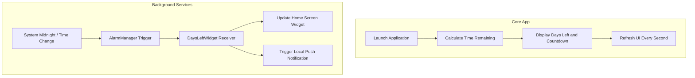

# Challenge App

Challenge App is a native Android application designed to help you stay motivated by tracking the exact number of days remaining until the end of the current year. It features a completely dark aesthetic, an automatic home screen widget, and daily motivational notifications.

## Features

- Fullscreen Dark UI: A pure black interface that displays the number of days left and a running countdown.
- Home Screen Widget: A sleek widget that updates automatically.
- Daily Notifications: Offline push notifications triggered exactly at midnight to remind you of the days remaining.

## Flowchart

The following flowchart explains the architecture and logic of the application:

## Setup

1. Clone the repository.
2. Open the project in Android Studio.
3. Build and run on an emulator or physical device running Android 7.0 (API 24) or higher.
4. For Android 13 (API 33) and above, grant the notification permission when prompted to receive midnight updates.

## Architecture Notes

- The countdown runs purely on the main UI thread while the app is open.
- Background updates for the widget and notifications are handled using Android's AlarmManager, ensuring accurate execution at midnight without draining battery via continuous background processes.
